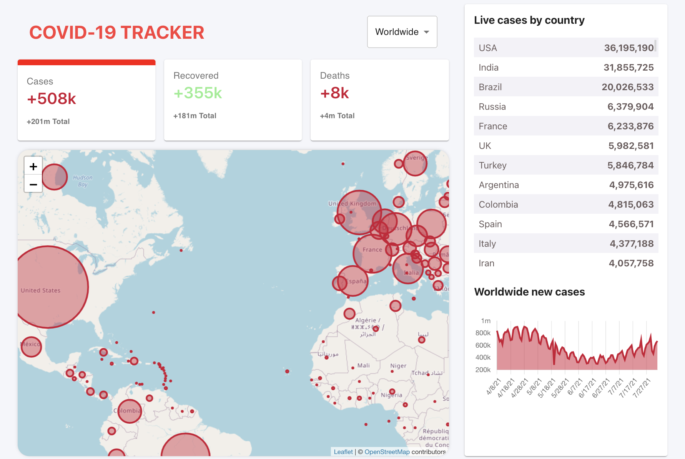
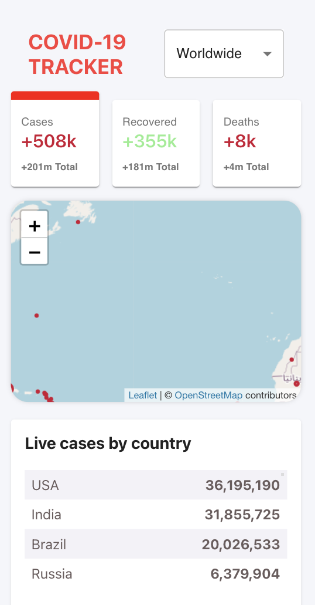

<h1 align="center">🦠 Covid-19 Tracker 🦠</h1>

<p align="center"> Made in React, constructed with create-react-app, utilizing disease.sh API. </p>
<p align="center">
  
  <a href="#" target="_blank">
    
  </a>
  <a href="https://twitter.com/mrginolee" target="_blank">
    
  </a>
</p>

<h2 align="center">☀️ <a href="https://covid-19-tracker-3342b.web.app/">See Live</a> ☀️</h2>

<p align="center">
<a href="https://covid-19-tracker-3342b.web.app/">
    
  </a>
  <a href="https://covid-19-tracker-3342b.web.app/">
    
  </a>
</p>

<h2 align="right">📖 &nbsp; Lessons Learned</h2>

<div align="right">

&nbsp; I wanted to make a responsive web app relevent and needed for todays world.\
&nbsp; My main focus was to create an **interactive dashboard** that pulls data dynamically using an external API.

&nbsp; This was my first use of **Material-UI** for easier and more efficient component styling.\
&nbsp; Using this framework made the styling process much faster.

&nbsp; I used **Chart.js** library to implement my table and the map was done with **Leaflet**.\
&nbsp; Both these components were easy to link up to the API and style.\
&nbsp; My first time setting up the leaflet map was a bit complicated due to weak documentation on their side.

&nbsp; **Firebase** was used for deployment which was not that different from gh-pages.\
&nbsp; I plan to explore and use firebase in my future project for simple back-end and authentication.

&nbsp; Again, this app tested my ablilty to fix & optimize for **mobile screen size**.\
&nbsp; However, this time the job was less tedious as styling was neatly organized in a Material-UI implementation.

</div>

## 🔮 &nbsp; Future Features

- 💉 &nbsp; Add vaccine stats
- 📅 &nbsp; Timeline of virus spread
- 🏙️ &nbsp; Filter cases by city
- 🌡️ &nbsp; Refine color pallete to reflect severity
- 📊 &nbsp; More interactive charts & tables

<h2 align="right">🚀 &nbsp; Deployment</h2>
<div align="right">

Deployed with [Firebase](https://covid-19-tracker-3342b.web.app)

</div>

## 🔨 &nbsp; Get Started

From your command line, first clone this repo:

```sh
# Clone this repository
$ git clone https://github.com/ginoleeswan/covid-19-tracker/

# Go into the repository
$ cd covid-19-tracker

# Remove current origin repository
$ git remote remove origin
```

### Install

```sh
npm install
```

### Usage

```sh
npm run start
```

### Run tests

```sh
npm run test
```

<div align="right">

## ✍️ &nbsp; Author

👤 **Gino Swanepoel**

&nbsp; Twitter: [@mrginolee](https://twitter.com/mrginolee)\
 &nbsp; Github: [@ginoleeswan](https://github.com/ginoleeswan)\
 &nbsp; LinkedIn: [@ginoswanepoel](https://linkedin.com/in/ginoswanepoel)

</div>

## ❤️ &nbsp; Show your support

Give a ⭐️ if this project helped you!
